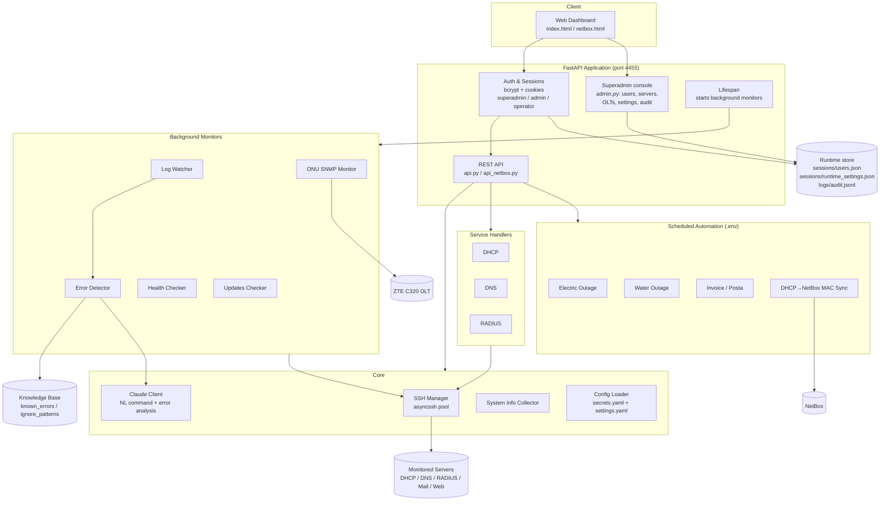

# MCP Server Monitor

> Intelligent server monitoring, auto-remediation, and operations automation with Claude AI integration.


A self-hosted control plane that watches a fleet of Linux servers over SSH, detects problems in real time, lets operators run natural-language commands (interpreted by Claude), and automates a set of recurring operational and billing tasks. It exposes a FastAPI backend, a lightweight web dashboard, and a role-gated superadmin console for managing users, servers, OLTs, and runtime settings without editing files by hand.

---

## Table of Contents

- [Overview](#overview)
- [Architecture](#architecture)
- [Features](#features)
- [Tech Stack](#tech-stack)
- [Project Structure](#project-structure)
- [Requirements](#requirements)
- [Installation](#installation)
- [Configuration](#configuration)
- [Running the Server](#running-the-server)
- [Web Interface](#web-interface)
- [REST API](#rest-api)
- [Monitoring & Automation Modules](#monitoring--automation-modules)
- [Knowledge Base](#knowledge-base)
- [Security](#security)
- [Development](#development)
- [Documentation](#documentation)
- [License](#license)

---

## Overview

MCP Server Monitor connects to remote servers over SSH and provides:

- **Live observability** — real-time log tailing, error pattern detection, periodic health checks, and update tracking across multiple hosts.
- **AI-assisted operations** — operators type plain-language commands (e.g. *"restart dhcp on dhcp-primary"*, *"show errors from the last hour"*); Claude interprets intent and the system executes the corresponding action, with a keyword-based fallback if the API is unavailable.
- **Service management** — first-class handlers for DHCP, DNS, and RADIUS (status, restart/reload, health diagnostics, log inspection). Postfix, Dovecot, Apache, and SpamAssassin are supported at a generic level (status/restart via SSH) without dedicated diagnostic handlers.
- **Operations automation** — a set of scheduled jobs handling utility-outage alerts, invoice generation/delivery, and inventory sync (see [Monitoring & Automation Modules](#monitoring--automation-modules)).
- **GPON visibility** — SNMP-based ONU monitoring for ZTE C320 OLTs (signal levels, status, MAC retrieval).
- **Administration** — a superadmin console for user/role management, live server & OLT CRUD, editable runtime settings (notifications, outage patterns/addresses), an append-only audit log, an SSH command console, and a Claude API health probe.

The application runs as a single ASGI service (Uvicorn + FastAPI) on port **4455** by default, plus optional systemd timer units for the scheduled jobs.

---

## Architecture



**Request flow (natural-language command):**
`Web UI → POST /api/execute → Claude interpret_command → execute_interpreted_command → Service handler / SSH → result`. If Claude confidence ≤ 0.7 or the API errors, the system falls back to keyword parsing (`status` / `restart` / `logs` / `health`).

---

## Features

### Infrastructure monitoring
- Real-time log watching via `tail -F` over SSH with auto-reconnect.
- Error detection against a YAML knowledge base of regex patterns, with noise filtering.
- Periodic health checks per server and per service.
- Daily system-update checks (cached for 24h).
- Support for both **systemd** and **SysVinit** init systems (auto-detected).

### AI integration (Claude)
- Natural-language command interpretation with confidence scoring.
- Unknown-error analysis (diagnosis, severity, suggested fixes).
- Response caching and rate limiting to control API usage.

### Service handlers
| Service | Status | Restart/Reload | Health diagnostics | Backends |
|--------|:------:|:--------------:|:------------------:|----------|
| DHCP | ✅ | ✅ | ✅ | isc-dhcp-server, kea-dhcp4, dnsmasq |
| DNS | ✅ | ✅ | ✅ | bind9, dnsmasq, unbound, PowerDNS |
| RADIUS | ✅ | ✅ | ✅ | FreeRADIUS |
| Postfix / Dovecot / Apache / SpamAssassin | ✅ | ✅ | ➖ generic | via generic SSH service control |

### GPON / ONU
- SNMP (v2c/v3) monitoring of ZTE C320 OLTs via CLI `snmpwalk`.
- Signal-level thresholds, ONU status decoding, SSH-based MAC retrieval.

### Operations automation
- Utility-outage alerting (electricity / water) with email notifications.
- Invoice generation and delivery (email + FTP), billing-DB driven.
- phpDHCPAdmin → NetBox MAC synchronization.
- Cisco switch → NetBox interface/VLAN/cable auto-fill.

### Web & API
- Session-based auth (bcrypt) with three roles: `superadmin` > `admin` > `operator`.
- Dashboard for servers, services, ONUs, utilities, and NetBox auto-fill.
- Full REST API (see below).

### Administration (superadmin)
- **User management** — create/delete users, change passwords and roles from the UI (`manage_users.py` CLI also available). The last remaining superadmin cannot be deleted or demoted.
- **Live infrastructure config** — add/edit/remove monitored servers and OLTs, then hot-reload without a restart. Seeded once from `secrets.yaml`, after which the runtime store is authoritative.
- **Editable runtime settings** — notification channels, the water-outage (acc.md) match pattern, and the power-outage address list.
- **Audit log** — every privileged action (user/role changes, config edits, console commands) is appended to `logs/audit.jsonl` and viewable in the console.
- **SSH command console** — run raw commands on a monitored server from the browser (admin/superadmin only; every command is audited).
- **Claude health probe** — one-click check that the configured Claude key and model respond.

---

## Tech Stack

- **Language:** Python 3.10+
- **Web:** FastAPI + Uvicorn (ASGI)
- **SSH:** asyncssh (core), paramiko + netmiko (automation/Cisco)
- **AI:** Anthropic Claude API
- **Config:** Pydantic models over YAML + dotenv
- **Auth:** bcrypt, itsdangerous sessions
- **Docs/Reports:** openpyxl (XLSX), fpdf2 (PDF)
- **Logging:** loguru
- **Frontend:** vanilla HTML/CSS/JS (no build step)

---

## Project Structure

```
ServersMonitoringMCP/
├── src/
│   ├── main.py                 # Entry point (python -m src.main)
│   ├── core/
│   │   ├── config.py           # Pydantic config loader (secrets + settings)
│   │   ├── ssh_manager.py      # Async SSH pool, command/service execution
│   │   ├── claude_client.py    # Claude API: NL interpretation + error analysis
│   │   └── system_info.py      # Server hardware/OS/network info collector
│   ├── services/               # Service handlers (extend BaseService)
│   │   ├── base.py
│   │   ├── dhcp.py
│   │   ├── dns.py
│   │   └── radius.py
│   ├── actions/                # (scaffolding) auto-remediation action layer
│   ├── knowledge/              # (scaffolding) knowledge-base helpers
│   ├── notifications/          # (scaffolding) notification dispatch
│   ├── storage/                # (scaffolding) persistence helpers
│   ├── monitoring/             # Background monitors + automation jobs
│   │   ├── log_watcher.py
│   │   ├── error_detector.py
│   │   ├── health_checker.py
│   │   ├── updates_checker.py
│   │   ├── onu_monitor.py
│   │   ├── electric_monitor.py
│   │   ├── acc_monitor.py
│   │   ├── invoice_generator.py
│   │   ├── posta_generator.py
│   │   ├── email_invoice_sender.py
│   │   └── dhcp_mac_sync.py
│   └── web/
│       ├── app.py              # FastAPI app factory + lifespan
│       ├── api.py              # Main REST API (incl. console/exec, claude/health)
│       ├── api_netbox.py       # NetBox auto-fill API
│       ├── admin.py            # Superadmin console API (/api/admin/*)
│       ├── auth.py             # Login, sessions, 3-role model
│       ├── users.py            # JSON-backed runtime user store
│       ├── runtime_config.py   # Live-editable settings + server/OLT store
│       └── audit.py            # Append-only audit log (logs/audit.jsonl)
├── services/
│   └── netbox-autofill/        # Standalone Cisco→NetBox automation
│       ├── orchestrator.py
│       ├── netbox_client.py
│       └── ssh_connector.py
├── config/
│   ├── settings.yaml           # Non-sensitive runtime settings
│   ├── safe_actions.yaml       # Auto-remediation risk policy
│   ├── services/               # Per-service detection/config (dhcp/dns/radius)
│   ├── electric_addresses.txt  # Addresses watched for power outages
│   ├── invoice_clienti_email.txt
│   └── postamoldovei_clienti.txt
├── knowledge_base/
│   ├── known_errors.yaml       # Regex error patterns + diagnoses
│   ├── ignore_patterns.yaml    # Log noise filters
│   └── learned/                # Runtime-learned patterns
├── web/                        # Static dashboard
│   ├── index.html              # Dashboard + superadmin console
│   ├── login.html
│   ├── netbox.html
│   ├── css/style.css
│   └── js/                     # app.js, api.js, admin.js, onu.js, login.js
├── scripts/                    # Test/util scripts + systemd unit/timer files
│                               #   incl. manage_users.py, check_claude.py, check_electric.py
├── fonts/                      # DejaVu fonts (PDF generation)
├── secrets.example.yaml        # Template -> copy to secrets.yaml
├── .env.example                # Template -> copy to .env
├── requirements.txt
├── server_launch.md            # Quick systemd deployment notes
└── README.md
```

> Runtime-only / gitignored directories (`venv/`, `keys/`, `sessions/`, `logs/`, `invoices_logs/`, `secrets.yaml`, `.env`) are not part of the repository.

---

## Requirements

**Python:** 3.10 or newer.

**Python packages:** see [`requirements.txt`](requirements.txt).

**System packages** (required by some modules — install via your package manager):

| Package | Needed for |
|---------|-----------|
| `openssh-client` | all SSH operations (usually preinstalled) |
| `snmp` (`snmpwalk`) | ONU / GPON monitoring |
| `mysql-client` | billing/invoice DB queries (CLI-based) |

```bash
sudo apt update && sudo apt install -y openssh-client snmp mysql-client
```

**Access requirements:**
- SSH access (key or password) to each monitored server; sudo for service control.
- A Claude API key for AI features (optional — keyword fallback works without it).
- SMTP / FTP / billing-DB credentials only if you enable the automation modules.

---

## Installation

```bash
# 1. Get the code
git clone <your-repo-url> ServersMonitoringMCP
cd ServersMonitoringMCP

# 2. Create and activate a virtualenv
python3 -m venv venv
source venv/bin/activate

# 3. Install dependencies
pip install -r requirements.txt

# 4. Create config from templates
cp secrets.example.yaml secrets.yaml
cp .env.example .env            # only needed for automation modules

# 5. Edit configuration (see below)
nano secrets.yaml
nano .env

# 6. Add SSH keys (if using key auth)
mkdir -p keys
cp /path/to/server.key keys/
chmod 600 keys/*

# 7. Run
python -m src.main
```

Then open **http://localhost:4455**.

---

## Configuration

The project uses **two** configuration layers plus runtime settings:

### 1. `secrets.yaml` — infrastructure secrets
Defines monitored servers, SSH/sudo credentials, Claude API key, web users, email, and ONU/OLT devices. Copy from `secrets.example.yaml`. Key sections:

- `servers[]` — `id`, `host`, `port`, `user`, `auth_type` (`key`/`password`), `auth_value`, optional `sudo_password`, `distro`, `services[]`, `enabled`.
- `onu_monitoring` — OLT devices (SNMP v2c/v3 + SSH for MAC).
- `mcp_server` — web host/port, session secret, session expiry.
- `claude` — API key, model, token limit, timeout.
- `email` — SMTP for built-in notifications.
- `web_users[]` — dashboard logins (`superadmin` / `admin` / `operator`); plaintext passwords are hashed on first run.

> **Runtime store — read this.** On first run, `web_users`, `servers`, and `onu_monitoring` seed a JSON-backed runtime store (`sessions/users.json`, `sessions/runtime_settings.json`). **After seeding, that store — not `secrets.yaml` — is the source of truth** for users, servers, and OLTs, so later edits are done through the superadmin console (or `scripts/manage_users.py`). Editing `secrets.yaml` after the first run has no effect unless you clear the corresponding store file. Claude/email/session secrets are still read from `secrets.yaml`.

### 2. `.env` — automation secrets
Read by the business-automation modules (electric/water outage, invoicing, MAC sync). Copy from `.env.example`. Covers SMTP, FTP (posta.md), billing DB, NetBox token, and per-job email recipients. **This layer is separate from `secrets.yaml`** — both are gitignored.

### 3. `config/settings.yaml` — runtime behavior
Non-sensitive tuning: monitoring intervals, error processing, Claude cache/rate-limit, logging, incidents retention.

### Other config files
- `config/safe_actions.yaml` — risk policy for auto-remediation (which actions may auto-run).
- `config/services/*.yaml` — per-service detection commands and parameters.
- `config/electric_addresses.txt` — addresses to watch for power outages.
- `config/invoice_clienti_email.txt`, `config/postamoldovei_clienti.txt` — invoice recipient lists.

---

## Running the Server

### Development
```bash
source venv/bin/activate
python -m src.main
# or:  ./scripts/run.sh
```

### Production (systemd)
Create the service unit (see also `server_launch.md`):

```ini
# /etc/systemd/system/mcp-monitor.service
[Unit]
Description=MCP Server Monitor
After=network.target

[Service]
Type=simple
User=user
WorkingDirectory=/home/user/ServersMonitoringMCP
Environment="PATH=/home/user/ServersMonitoringMCP/venv/bin:/usr/local/bin:/usr/bin:/bin"
ExecStart=/home/user/ServersMonitoringMCP/venv/bin/python -m src.main
Restart=always
RestartSec=5

[Install]
WantedBy=multi-user.target
```

```bash
sudo systemctl daemon-reload
sudo systemctl enable --now mcp-monitor
sudo systemctl status mcp-monitor
```

### Scheduled automation (timers)
The `scripts/` directory ships systemd `.service` + `.timer` units for the periodic jobs (e.g. `electric-monitor`, `acc-monitor`). Install them the same way and enable the timers:

```bash
sudo systemctl enable --now electric-monitor.timer
sudo systemctl enable --now acc-monitor.timer
```

---

## Web Interface

- **Login** at `/login.html`; credentials come from the runtime user store (seeded from `secrets.yaml` on first run).
- **Dashboard** (`/`): server cards with live status, service controls, recent errors/health, utility (electric/water) indicators, ONU overview, and a natural-language command box.
- **Superadmin console** (in the dashboard, superadmin only): user & role management, live server/OLT CRUD, editable notification/outage settings, the audit-log viewer, an SSH command console, and the Claude health check.
- **NetBox** (`/netbox.html`): scan a Cisco switch and apply interface/VLAN/cable updates to NetBox.

Roles: `superadmin` has full control including the admin console; `admin` can execute commands and trigger actions; `operator` is read-only.

---

## REST API

All endpoints are under `/api`. Authentication is session-based; most require a logged-in user, command/action endpoints require `admin`.

### Status & servers
| Method | Path | Description |
|--------|------|-------------|
| GET | `/api/status` | Overall fleet status |
| GET | `/api/servers` | List configured servers |
| GET | `/api/servers/{id}` | Server detail + services |
| GET | `/api/servers/{id}/info` | Full hardware/OS/network report |
| POST | `/api/servers/{id}/action` | Service action (restart/reload/…) |
| GET | `/api/servers/{id}/services/{type}/diagnostics/{name}` | Run a service diagnostic |

### Commands & monitoring
| Method | Path | Description |
|--------|------|-------------|
| POST | `/api/execute` | Natural-language command (Claude + fallback) |
| POST | `/api/service/restart` | Restart a service |
| POST | `/api/console/exec` | Run a raw command on a server (admin, audited) |
| GET | `/api/claude/health` | Verify Claude key/model are reachable |
| GET | `/api/monitoring/status` | Monitor subsystem status |
| GET | `/api/monitoring/errors` | Recent detected errors |
| GET | `/api/monitoring/health` | Latest health reports |
| GET | `/api/health` | App liveness probe |

### Updates
| Method | Path | Description |
|--------|------|-------------|
| GET | `/api/updates/status` | Cached update info |
| POST | `/api/updates/refresh` | Force refresh (admin) |
| POST | `/api/servers/{id}/updates/check` | Check one server |

### ONU / GPON
| Method | Path | Description |
|--------|------|-------------|
| GET | `/api/onu/status` | Aggregated ONU status |
| GET | `/api/onu/olts` | List OLTs |
| GET | `/api/onu/olt/{id}` | ONUs on an OLT |
| POST | `/api/onu/olt/{id}/poll` | Poll an OLT now |

### Utilities & invoicing
| Method | Path | Description |
|--------|------|-------------|
| GET | `/api/electric/status` · POST `/api/electric/check` | Power-outage status / check now |
| GET | `/api/acc/status` · POST `/api/acc/check` | Water-outage status / check now |
| POST | `/api/invoice/generate` ⚠️ | Generate invoices (temporary) |
| POST | `/api/invoice/send-emails` ⚠️ | Send invoice emails (temporary) |

### Auth
| Method | Path | Description |
|--------|------|-------------|
| POST | `/api/auth/login` · `/api/auth/logout` | Session login/logout |
| GET | `/api/auth/me` · `/api/auth/check` | Current user / auth check |

### Admin console (superadmin only)
All endpoints are under `/api/admin` and require the `superadmin` role.

| Method | Path | Description |
|--------|------|-------------|
| GET | `/api/admin/users` | List users + valid roles |
| POST | `/api/admin/users` | Create a user |
| DELETE | `/api/admin/users/{username}` | Delete a user (not the last superadmin) |
| PUT | `/api/admin/users/{username}/password` | Change a user's password |
| PUT | `/api/admin/users/{username}/role` | Change a user's role (not the last superadmin) |
| GET | `/api/admin/audit` | Read the audit log |
| GET/PUT | `/api/admin/config/notifications/{channel}` | Get/set a notification channel |
| GET/PUT | `/api/admin/config/acc-pattern` | Get/set the water-outage match pattern |
| GET/PUT | `/api/admin/config/electric-addresses` | Get/set the power-outage address list |
| GET/POST | `/api/admin/config/servers` | List / add monitored servers |
| PUT/DELETE | `/api/admin/config/servers/{id}` | Edit / remove a server |
| GET/POST | `/api/admin/config/olts` | List / add OLTs |
| PUT/DELETE | `/api/admin/config/olts/{id}` | Edit / remove an OLT |
| POST | `/api/admin/config/reload` | Hot-reload config from the runtime store |

### NetBox auto-fill
| Method | Path | Description |
|--------|------|-------------|
| GET | `/api/netbox/health` | Connectivity check |
| POST | `/api/netbox/scan` · `/api/netbox/apply` · `/api/netbox/auto` | Switch scan / apply / one-shot |
| POST | `/api/netbox/scan-router` · `/api/netbox/apply-router` | Router variants |
| POST | `/api/netbox/sync-mac` | DHCP→NetBox MAC sync |

> Interactive API docs are available at `/docs` (Swagger UI) when the server is running.

---

## Monitoring & Automation Modules

| Module | Purpose | Config source |
|--------|---------|---------------|
| `log_watcher` | Real-time SSH log tailing | `settings.yaml`, servers |
| `error_detector` | Match logs to known patterns | `knowledge_base/` |
| `health_checker` | Periodic per-service health | `settings.yaml` |
| `updates_checker` | Daily system-update tracking | `settings.yaml` |
| `onu_monitor` | ZTE C320 ONU SNMP monitoring | `secrets.yaml` (OLTs) |
| `electric_monitor` | Premier Energy outage alerts | `.env`, `config/electric_addresses.txt` |
| `acc_monitor` | acc.md water outage alerts | `.env` |
| `invoice_generator` ⚠️ | Billing → XLS → email (Paynet) | `.env`, `config/invoice_clienti_email.txt` |
| `posta_generator` ⚠️ | Billing → XLSX → FTP (posta.md) | `.env`, `config/postamoldovei_clienti.txt` |
| `email_invoice_sender` ⚠️ | Billing → PDF → email (WHMCS) | `.env` |
| `dhcp_mac_sync` | phpDHCPAdmin MySQL → NetBox | `.env` |

> ⚠️ **Temporary feature — scheduled for removal.** The invoicing modules and
> their UI buttons / endpoints (`POST /api/invoice/generate`,
> `POST /api/invoice/send-emails`) are provisional and will be removed from the
> project in a future cleanup. Do not build new functionality on top of them.

---

## Knowledge Base

Error handling is data-driven via YAML:

- **`knowledge_base/known_errors.yaml`** — per-service regex patterns with `severity`, `auto_fix`, `diagnosis`, `suggestions`, optional fix `commands`, and `cooldown`.
- **`knowledge_base/ignore_patterns.yaml`** — regex filters to suppress log noise.
- **`knowledge_base/learned/`** — runtime-learned patterns.

Auto-remediation is gated by **`config/safe_actions.yaml`**, which classifies actions by risk level (0–3). Only low-risk actions may auto-execute; destructive operations always require manual confirmation.

---

## Security

- Secrets live in `secrets.yaml` and `.env`, both gitignored — never commit them.
- SSH private keys live in `keys/` (chmod `600`), gitignored.
- Web passwords are bcrypt-hashed; sessions are signed cookies with configurable expiry.
- The runtime store (`sessions/users.json`, `sessions/runtime_settings.json`) and audit log (`logs/audit.jsonl`) live under gitignored directories — never commit them.
- Privileged actions are role-gated: the admin console requires `superadmin`, and the SSH command console (`POST /api/console/exec`) requires at least `admin`. Every such action is written to the audit log.
- Auto-remediation is constrained by an explicit risk policy (`safe_actions.yaml`).
- Rotate the `session_secret` and all credentials before any production deployment.

> **CORS note:** the app currently allows all origins (`*`). Restrict this for internet-facing deployments.

---

## Development

### Test scripts
```bash
python scripts/test_ssh.py <server-id>        # SSH connectivity
python scripts/test_dhcp.py <server-id>       # DHCP handler
python scripts/test_monitoring.py             # monitoring pipeline
python scripts/test_claude.py                 # Claude API
python scripts/check_claude.py                # Claude key/model health
python scripts/check_electric.py              # power-outage checker
python scripts/manage_users.py                # CLI user management
```

### Adding a new service handler
1. Create `src/services/<name>.py` extending `BaseService`.
2. Add `config/services/<name>.yaml` (detection + parameters).
3. Register it in the `service_handlers` map in `src/web/api.py`.

### Conventions
- Async throughout (FastAPI + asyncssh).
- Config is centralized in `src/core/config.py` (Pydantic models — extend there).
- Singletons via `get_*()` accessors (e.g. `get_ssh_manager()`, `get_config()`).
- Logging via `loguru`.

---

## Documentation

Extended docs live in [`docs/`](docs/):

- [`docs/AGENTS.md`](docs/AGENTS.md) — onboarding map for developers and AI assistants (module reference, conventions, gotchas).
- [`docs/ARCHITECTURE.md`](docs/ARCHITECTURE.md) — layers, runtime model, and data flows.
- [`docs/CONFIGURATION.md`](docs/CONFIGURATION.md) — every config field across `secrets.yaml`, `.env`, and `settings.yaml`.
- [`docs/DEPLOYMENT.md`](docs/DEPLOYMENT.md) — systemd setup for the web service and timer jobs.
- [`docs/API.md`](docs/API.md) — REST API reference.

---

## License

MIT License.
test
